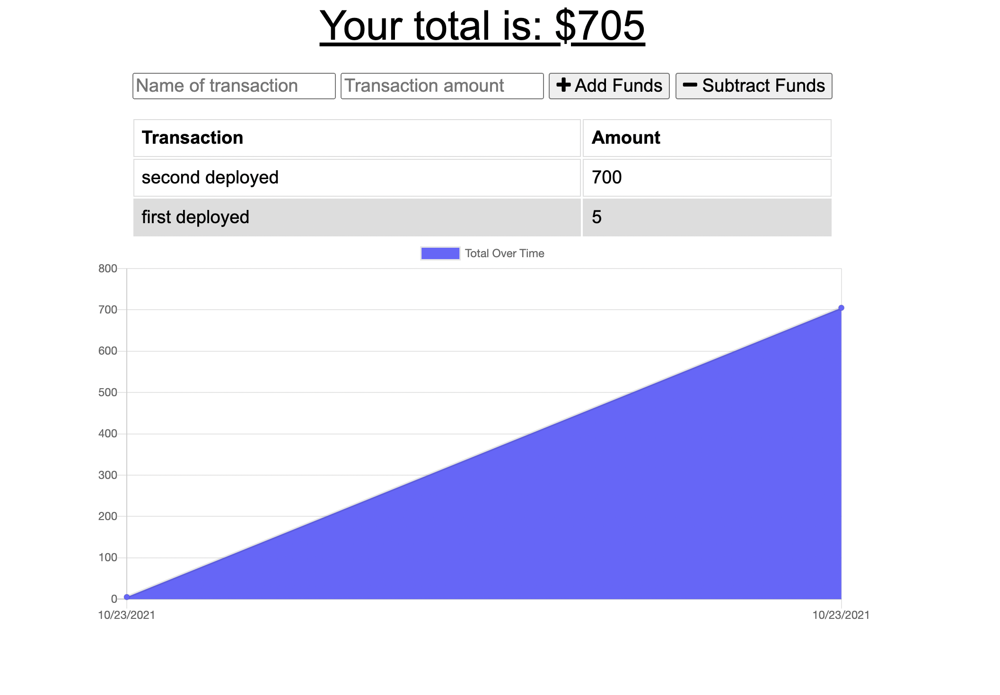

# Budget Tracker

## A minimalist app for tracking your spending and saving. Since it's a PWA, your transactions will be there next time you visit, and you can still use the app if you lose your internet connection. It will simply save all of your changes and update them the next time you have a connection!

## Languages

JS
HTML
CSS
MongoDB
Mongoose
Express

## Screenshot

## Created by

Thomas Upchurch

## Contact

thomascupchurch@gmail.com
github.com/thomascupchurch
